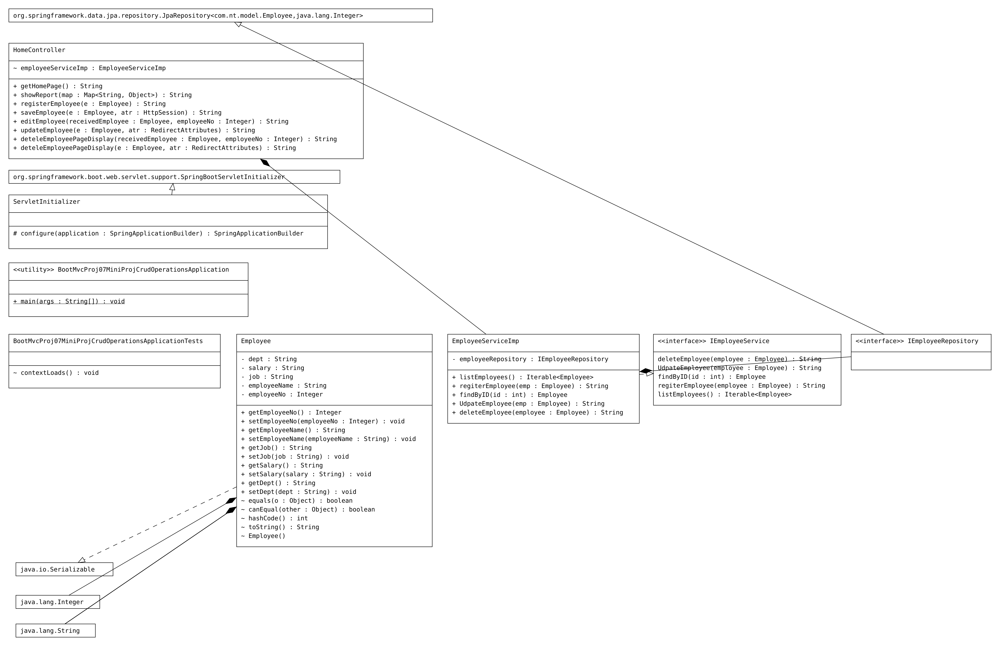

# BootMVCProj07_MiniProj_CRUD_Operations
BootMVCProj07_MiniProj_CRUD_Operations

# Controller
```Java
package com.nt.controller;

import java.util.List;
import java.util.Map;

import org.apache.catalina.mbeans.MBeanUtils;
import org.springframework.beans.BeanUtils;
import org.springframework.beans.factory.annotation.Autowired;
import org.springframework.stereotype.Controller;
import org.springframework.web.bind.annotation.GetMapping;
import org.springframework.web.bind.annotation.ModelAttribute;
import org.springframework.web.bind.annotation.PathVariable;
import org.springframework.web.bind.annotation.PostMapping;
import org.springframework.web.bind.annotation.RequestParam;
import org.springframework.web.servlet.mvc.support.RedirectAttributes;

import com.nt.model.Employee;
import com.nt.service.EmployeeServiceImp;

import ch.qos.logback.core.joran.util.beans.BeanUtil;
import jakarta.servlet.http.HttpSession;

@Controller
public class HomeController {

	@Autowired
	EmployeeServiceImp employeeServiceImp;

	@GetMapping("/")
	public String getHomePage() {
		System.out.println("HomeController.getHomePage()");
		return "home";
	}

	@GetMapping("/reportOne")
	public String showReport(Map<String, Object> map) {

		List<Employee> list = (List<Employee>) employeeServiceImp.listEmployees();

		for (Employee employee : list) {
			System.out.println("-----------------");
			System.out.println(employee.getDept());
			System.out.println(employee.getEmployeeName());
			System.out.println(employee.getJob());
			System.out.println(employee.getSalary());
			System.out.println("-----------------");

		}
		map.put("employees", list);
		System.out.print("list from contoller class " + employeeServiceImp.listEmployees());

		return "showReport";
	}

	@GetMapping("/register") // display register form
	public String registerEmployee(@ModelAttribute("employee") Employee e) {
		System.out.println("HomeController.registerEmployee()");

		return "addEmployee";
	}

//	@PostMapping("/register") // display register form
//	public String saveEmployee(@ModelAttribute("employee") Employee e, RedirectAttributes atr) {
//		System.out.println("HomeController.saveEmployee()");
//		
//		Iterable<Employee> employees = employeeServiceImp.listEmployees();
//		
//		
//
//		String message = employeeServiceImp.regiterEmployee(e);
//		atr.addAttribute("message", message);
//		return "redirect:reportOne";
//
//	}

	@PostMapping("/register") // display register form
	public String saveEmployee(@ModelAttribute("employee") Employee e, HttpSession atr) {
		System.out.println("HomeController.saveEmployee()");

		Iterable<Employee> employees = employeeServiceImp.listEmployees();

		String message = employeeServiceImp.regiterEmployee(e);
		atr.setAttribute("message", message);
		return "redirect:reportOne";

	}

	@GetMapping("/edit") // display register form
	public String editEmployee(@ModelAttribute("employee") Employee receivedEmployee,
			@RequestParam Integer employeeNo) {

		System.out.println("HomeController.editEmployee()");

//		Iterable<Employee> employees = employeeServiceImp.listEmployees();

//		String message = employeeServiceImp.regiterEmployee(receivedEmployee);

		Employee foundEmployee = employeeServiceImp.findByID(employeeNo);

		BeanUtils.copyProperties(foundEmployee, receivedEmployee);

		return "editEmployee";

	}

	@PostMapping("/edit") // display register form
	public String updateEmployee(@ModelAttribute("employee") Employee e, RedirectAttributes atr) {

		System.out.println("HomeController.updateEmployee()");

		String message = employeeServiceImp.UdpateEmployee(e)+ " has been updated";
		atr.addFlashAttribute("message", message);

		return "redirect:reportOne";

	}
	
	@GetMapping("delete")
	public String deteleEmployeePageDisplay(@ModelAttribute("employee") Employee receivedEmployee,
			@RequestParam Integer employeeNo)
	{
		System.out.println("HomeController.deteleEmployeePageDisplay()");
		
		Employee foundEmployee= employeeServiceImp.findByID(employeeNo);

		BeanUtils.copyProperties(foundEmployee, receivedEmployee);

		return "deleteEmployee";
	}
	
	@PostMapping("/delete") // display register form
	public String deteleEmployeePageDisplay(@ModelAttribute("employee") Employee e, RedirectAttributes atr) {

		System.out.println("HomeController.updateEmployee()");

		String message = employeeServiceImp.deleteEmployee(e)+" has been deleted";
		atr.addFlashAttribute("message", message);

		return "redirect:reportOne";

	}

}

```
# Model
```Java
package com.nt.model;

import java.io.Serializable;
import jakarta.persistence.Entity;
import jakarta.persistence.GeneratedValue;
import jakarta.persistence.GenerationType;
import jakarta.persistence.Id;
import jakarta.persistence.SequenceGenerator;
import lombok.Data;

//TODO why data is not working, added getts and setts manaully
@Data
@Entity
public class Employee implements Serializable {

	@Id
	@SequenceGenerator(name = "gen1", sequenceName = "EMP_SEQ", initialValue = 5, allocationSize = 1)
	@GeneratedValue(generator = "gen1", strategy = GenerationType.SEQUENCE)
	private Integer employeeNo;

	public Integer getEmployeeNo() {
		return employeeNo;
	}

	public void setEmployeeNo(Integer employeeNo) {
		this.employeeNo = employeeNo;
	}

	public String getEmployeeName() {
		return employeeName;
	}

	public void setEmployeeName(String employeeName) {
		this.employeeName = employeeName;
	}

	public String getJob() {
		return job;
	}

	public void setJob(String job) {
		this.job = job;
	}

	public String getSalary() {
		return salary;
	}

	public void setSalary(String salary) {
		this.salary = salary;
	}

	public String getDept() {
		return dept;
	}

	public void setDept(String dept) {
		this.dept = dept;
	}

	private String employeeName;
	private String job;
	private String salary;
	private String dept;
}

```
Repository
```Java
package com.nt.repository;

import org.springframework.data.jpa.repository.JpaRepository;

import com.nt.model.Employee;

public interface IEmployeeRepository extends JpaRepository<Employee, Integer> {

}
```
# Service
```Java
package com.nt.service;

import com.nt.model.Employee;

public interface IEmployeeService {

	public Iterable<Employee> listEmployees();

	public String regiterEmployee(Employee employee);
	
	public Employee findByID(int id);
	
	public String UdpateEmployee(Employee employee);
	
	public String deleteEmployee(Employee employee);

}

```
# Service Implementation
```Java
package com.nt.service;

import java.util.List;
import java.util.Optional;

import org.springframework.beans.factory.annotation.Autowired;
import org.springframework.stereotype.Service;

import com.nt.model.Employee;
import com.nt.repository.IEmployeeRepository;

@Service
public class EmployeeServiceImp implements IEmployeeService {

	@Autowired
	private IEmployeeRepository employeeRepository;

	@Override
	public Iterable<Employee> listEmployees() {

		List<Employee> list = employeeRepository.findAll();
		System.out.println("EmployeeServiceImp.listEmployees()" + list);

		System.out.print("------------");

		for (Employee country : list) {
			System.out.println("Salary " + country.getSalary());
			System.out.println("Dept  " + country.getDept());
			System.out.println("Employee Name  " + country.getEmployeeName());
			System.out.println("Job  " + country.getJob());
		}

		System.out.print("------------");
		return list;
	}

	@Override
	public String regiterEmployee(Employee emp) {

		int value = employeeRepository.save(emp).getEmployeeNo();
		return value + " is inserted into database";
	}

	@Override
	public Employee findByID(int id) {

		Employee employeeRecord = employeeRepository.findById(id).get();

		return employeeRecord;
	}

	@Override
	public String UdpateEmployee(Employee emp) {

		System.out.println("HomeController.updateEmployee()");

		Optional<Employee> empOptional = employeeRepository.findById(emp.getEmployeeNo());

		if (empOptional.isPresent()) {
			employeeRepository.save(emp);
			return "Employee updated";

		}
		return "Employee NOT updated";

	}

	@Override
	public String deleteEmployee(Employee employee) {
		System.out.println("EmployeeServiceImp.deleteEmployee()");
		
		employeeRepository.deleteById(employee.getEmployeeNo());
		
		return employee.getEmployeeNo()+"";
	}

}

```
# UML
